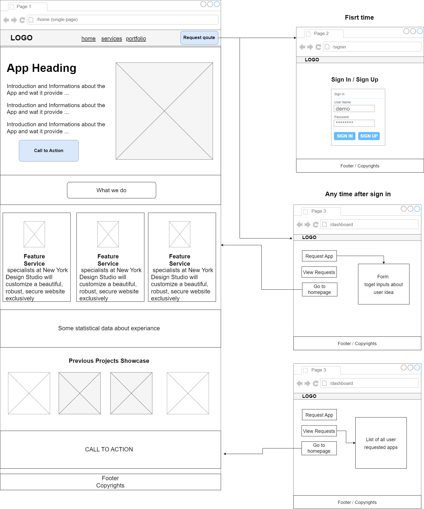

# Simple App Studio (SAS)

## Rules:
[Requirements](requirements.md)

## Backend plan:
### Creating REST API server
> (V1) file-based DB server
Create a rest api (JSON) based server, which will have the functionality t:       
- Create data
- Read data
- Update data
- Delete Data

### Notes:
All data sent or received **must** be in **JSON** format   

### Create App routes
Create main app route pages
- Homepage
- Dashboard

## Frontend:


## Record structure:

Initial Structure:        

```json
{
  "id": id,
  "name": "name",
  "idea": "idea",
  "url": "url"
}
```

## Testing and Refactor when needed